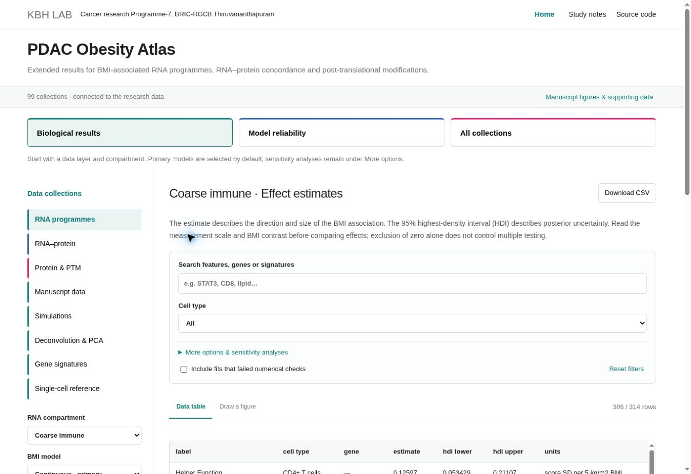

# PDAC Obesity Atlas — analysis code

Analysis code and an interactive results atlas for BMI-associated RNA programmes, RNA–protein concordance and post-translational modifications in pancreatic ductal adenocarcinoma.

**[Open the PDAC Obesity Atlas](https://kbh-lab-rgcb.github.io/models-obesity/)** · **[KBH Lab](https://kbh-lab-rgcb.github.io/)**

The atlas provides aggregate effect estimates, uncertainty intervals, model diagnostics, gene signatures, deconvolution QC, simulations and manuscript supporting data. Figures are generated from the selected database records using the study's Python plotting code.

## Analysis index

Each entry links to a retained analysis workflow. Configure notebook input paths and workflow switches before execution. Distinct primary, descriptive and sensitivity analyses are identified below.

| Analysis | Code | Role |
| --- | --- | --- |
| Compartment QC and weighted PCA | [Notebook](analysis/deconvolution/compartment_qc_and_pca.ipynb) · [Instructions](analysis/deconvolution/README.md) | Audits completed BayesPrism outputs and constructs tiered and strict-QC PCA summaries. |
| Continuous BMI with low-read exclusion | [Notebook](analysis/rna/low_read_sensitivity.ipynb) | Primary RNA analyses; select each of the three compartments. |
| Continuous BMI, cell-type-specific tail parameter | [Notebook](analysis/rna/continuous_celltype_nu.ipynb) | All-profile coarse-immune comparison. |
| Continuous BMI, shared tail parameter | [Notebook](analysis/rna/continuous_global_nu.ipynb) | All-profile fine-immune and nonimmune comparisons. |
| Categorical BMI | [Notebook](analysis/rna/categorical_bmi.ipynb) | Descriptive three-group contrasts and patient-influence analysis. |
| Read-dependent residual scale | [Notebook](analysis/rna_extension/read_dependent_scale.ipynb) · [Instructions](analysis/rna_extension/README.md) | Six sensitivity fits: three compartments, each with filtered and all eligible profiles. |
| Paired RNA–protein | [Notebook](analysis/paired/rna_protein_paired.ipynb) | Joint models, sensitivity analyses and paired within-plex bootstrap. |
| Paired protein–PTM | [Notebook](analysis/paired/protein_ptm_paired.ipynb) | Primary marginal and protein-conditioned PTM effects. |
| PTM screen summaries | [Notebook](analysis/paired/ptm_screen_analysis.ipynb) | Numerical checks and summaries of the completed primary screen. |
| PTM sensitivity and calibration | [Runner](analysis/ptm_extension/run.py) · [Instructions](analysis/ptm_extension/README.md) | Eight specifications for 24 candidates and five calibration scenarios with 50 datasets each. |

### Supporting analysis modules

| Module | Purpose |
| --- | --- |
| [bhm_extension.py](analysis/rna_extension/bhm_extension.py) | RNA model construction and diagnostics for read-dependent residual-scale sensitivity. |
| [orthoprec.py](analysis/rna_extension/orthoprec.py) | Six-fit RNA workflow and comparisons with archived primary fits. |
| [ptm_core.py](analysis/ptm_extension/ptm_core.py) | Paired protein/PTM preparation, design matrices, model and posterior quantities. |
| [run_ptm.py](analysis/ptm_extension/run_ptm.py) | PTM sensitivity specifications, simulation generation and calibration summaries. |
| [run_common.py](analysis/ptm_extension/run_common.py) | Sampling, checkpoints, integrity checks and numerical diagnostics. |

## Reproducing the analyses

1. Obtain the frozen input archives and clinical/omics inputs described in the manuscript. Aggregate atlas tables do not replace the patient-level inputs required to fit these models. Data requests may be directed to [harikumar@rgcb.res.in](mailto:harikumar@rgcb.res.in).
2. Use the package versions specified by each workflow. Mount the input storage in Colab and configure its input paths, compartment, profile and execution stage. The RNA–protein checkpoint fingerprint also depends on the Python version recorded in the run contract.
3. Use a separate output location for a new analysis. For notebooks with a release checksum, point `NOTEBOOK_PATH_OVERRIDE` to the saved notebook being executed. Do not replace historical contracts to bypass a mismatch.
4. Follow the workflow's sampling, diagnostics, posterior predictive checks and aggregation stages. The paired notebooks support sharded execution; aggregate only completed compatible shards.

The PTM extension has explicit [frozen settings](analysis/ptm_extension/settings.json), [dependencies](analysis/ptm_extension/requirements.txt) and a command-line entry point. Detailed input requirements are in its [README](analysis/ptm_extension/README.md).

## Results and interpretation

The atlas links manuscript figures to full feature identities, paired effects, calibration metrics and sensitivity comparisons. The [manuscript data manifest](web/manuscript-manifest.json) records source hashes and row counts for those aggregate collections.

Intervals and support indicators must be interpreted using each analysis's stated decision rule. In particular, a PTM pointwise 95% HDI excluding zero does not provide panel-wide multiplicity control. Protein-conditioned PTM associations are not direct measurements of modification occupancy. Stage- and purity-adjusted sensitivity results use their corresponding subset baselines.

## Source verification

[Source fingerprints and validation](analysis/provenance.json) record the retained code and independent comparisons. The published RNA–protein initialization fingerprint was reproduced under Python 3.13.15. PTM extension settings and source provenance were checked against all 192 sensitivity and 250 calibration contracts. Notebook structure, syntax, cleared outputs and local documentation links were checked. These are source-level checks; the model fits were not rerun.

The indexed workflows begin from the stated frozen inputs. Upstream single-cell reference construction/deconvolution and the RNA simulation fitting source are not included in this code release.

## Atlas implementation

- [Website documentation](web/README.md), [interface](web/index.html), [application logic](web/app.js) and [styles](web/style.css).
- [Python figure generation](web/plotting.py) and [browser plotting worker](web/plot-worker.js).
- [Database documentation](database/README.md) and [schema](database/atlas_schema.sql).
- [Aggregate manuscript-data preparation](scripts/prepare_manuscript_release.py) and [renderer checks](tests/test_manuscript_renderer.py).

Run the renderer checks with `python -m unittest discover -s tests -p 'test_manuscript_renderer.py'` from the repository root.
